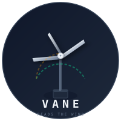
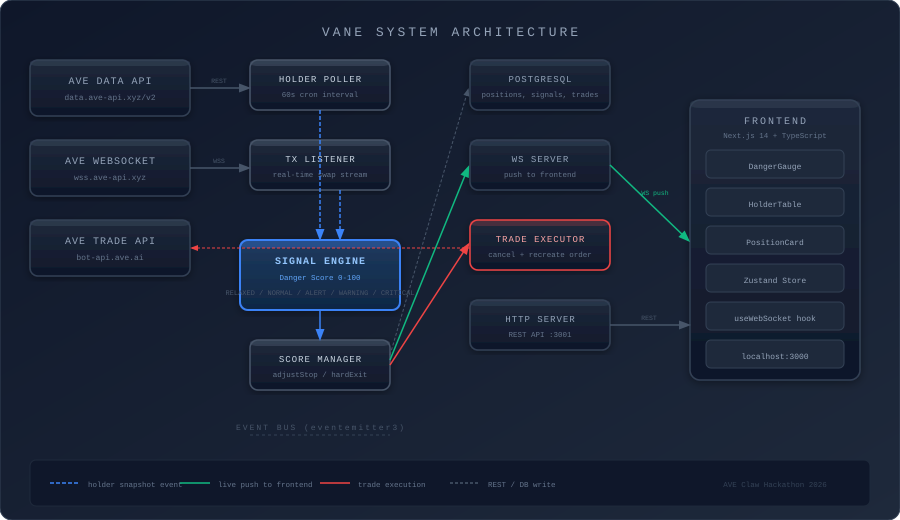
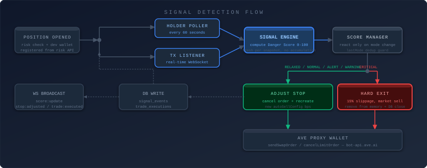
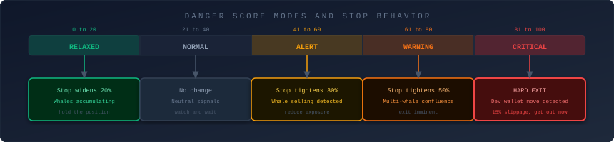
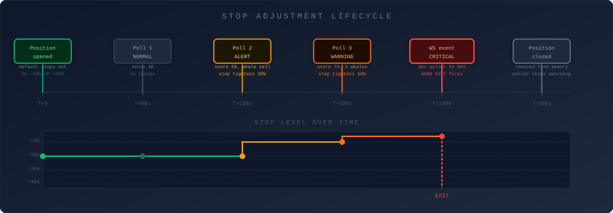

<p align="center">
  
</p>

<h1 align="center">VANE</h1>
<p align="center">Stops that read the wind, not the weather report.</p>

<br/>

Every DeFi trading bot today uses price-only stop losses. Price is the last thing to move. Whales distribute into strength, selling while the chart still looks bullish. By the time your price stop triggers, you have already given back most of your gains. And when whales deliberately hunt your stop level, a documented and systematic tactic, your position closes at the worst possible price right before the recovery.

VANE fixes this. It watches the top 100 holders of every token you hold in real time and moves your stop based on what they are actually doing, not where the chart looks vulnerable.

Built for the AVE Claw Hackathon 2026.

<br/>

## The Problem

In October 2025, 19 billion dollars was liquidated in a single day. Most of it was preventable. The on-chain data showing distribution was available hours before the price crashed. Nobody had a tool that connected that data to automated position management.

The specific moment every memecoin trader knows: you are watching the chart, the token is up 40 percent, you are not selling because it could still go higher. Price starts dropping. You tell yourself it is a dip. Down 30 percent. You check the top holders on Solscan. The developer wallet moved tokens to a DEX 45 minutes ago. The top holders have been selling for an hour. You were the last to know.

That is the product. The thing that would have told you 45 minutes earlier.

<br/>

## How It Works

VANE polls the top 100 holders of your token every 60 seconds and listens to real-time swap transactions via WebSocket. It computes a Danger Score from 0 to 100 based on holder behavior signals, then automatically adjusts your stop loss through the AVE proxy wallet.

**Danger Score Modes**

| Score | Mode | What happens to your stop |
|---|---|---|
| 0 to 20 | RELAXED | Stop widens 20 percent, whales are accumulating |
| 21 to 40 | NORMAL | No change |
| 41 to 60 | ALERT | Stop tightens 30 percent |
| 61 to 80 | WARNING | Stop tightens 50 percent |
| 81 to 100 | CRITICAL | Hard exit, 15 percent slippage tolerance, get out now |

**Signals that move the score**

| Signal | Weight | Trigger |
|---|---|---|
| WHALE SELL | plus 20 | Top 10 holder sold more than 5 percent of their position in 1 hour |
| MULTI WHALE SELL | plus 30 | 3 or more top 50 holders selling within a 30 minute window |
| DEV WALLET MOVE | plus 35 | Developer wallet sends tokens to a DEX, detected in real time via WebSocket |
| HOLDER COUNT DROP | plus 15 | Total holder count dropped more than 5 percent in 24 hours |
| WHALE BUY | minus 15 | Top 10 holder increasing their balance |
| NEW WHALE ENTRY | minus 10 | New wallet entered the top 50 |

Score is computed fresh on every snapshot from a neutral baseline. It does not accumulate across polls. If whales stop selling, the score comes back down.

<br/>

## Architecture

<p align="center">
  
</p>

The backend is a Node.js TypeScript process with an internal event bus. The holder poller fires every 60 seconds and emits snapshots. The WebSocket listener streams real-time swap events. Both feed into the signal engine which computes the Danger Score. The score manager reacts to mode changes by either adjusting the stop via the AVE proxy wallet or triggering a hard exit. All events are pushed to the frontend over a persistent WebSocket connection.

<br/>

## Signal Detection Flow

<p align="center">
  
</p>

When a position is opened, VANE registers the developer wallet from the risk API and starts two parallel monitoring paths. The holder poller runs every 60 seconds and computes balance deltas across the top 100 holders. The WebSocket listener catches every swap transaction in real time. Both paths feed the signal engine. The score manager only acts when the mode changes, preventing redundant order cancellations. RELAXED through WARNING modes adjust the stop. CRITICAL fires a hard exit and removes the position from memory so the poller stops watching it.

<br/>

## Danger Score Modes

<p align="center">
  
</p>

The score is computed fresh on every snapshot from a neutral baseline of 50. It does not accumulate across polls. If whales stop selling, the score comes back down. This prevents the system from getting stuck in a high-danger state after a single event that does not repeat.

<br/>

## Stop Adjustment Over Time

<p align="center">
  
</p>

This shows a typical position lifecycle. The stop starts at the default level. As whale selling is detected across successive polls, the stop tightens progressively. When the developer wallet moves tokens to a DEX, detected in real time via WebSocket, the hard exit fires immediately regardless of the current price. The position is closed in the database and removed from the in-memory map so no further polling occurs.

<br/>

## AVE Claw Integration

VANE uses both skill tracks required for the Complete Application category.

**Monitoring Skill**

The holder poller calls `GET /v2/tokens/holders/{token}-{chain}` every 60 seconds to get the top 100 holders with balances and percentages. The WebSocket listener subscribes to the `tx` topic on `wss://wss.ave-api.xyz` to receive real-time swap events. The risk API at `GET /v2/contracts/{token}-{chain}` is called at position open to check for honeypots and register the developer wallet address for hard exit detection.

**Trading Skill**

The proxy wallet API at `POST /v1/thirdParty/tx/sendSwapOrder` creates orders with `autoSellConfig` containing dynamic stop loss, take profit, and trailing stop rules in basis points. When the Danger Score changes mode, VANE cancels the existing order via `POST /v1/thirdParty/tx/cancelLimitOrder` and recreates it with adjusted parameters. The trade WebSocket at `wss://bot-api.ave.ai/thirdws` streams order execution confirmations back.

<br/>

## Stack

| Layer | Technology |
|---|---|
| Backend | Node.js 22, TypeScript, eventemitter3 |
| Frontend | Next.js 14, TypeScript, Tailwind CSS |
| Real-time | ws library, WebSocket push from backend |
| State | Zustand |
| Database | PostgreSQL |
| Scheduling | node-cron |

<br/>

## Setup

You need Node.js 18 or higher, a PostgreSQL instance, and an AVE Claw API key from cloud.ave.ai.

```
cd backend
cp .env.example .env
```

Fill in your AVE API key, access key, secret key, and assets ID in the .env file. Then:

```
cd backend && npm install && npm run dev
cd frontend && npm install && npm run dev
```

Open http://localhost:3000. The backend runs on port 3001 and the WebSocket server on port 8080.

The WebSocket tx listener requires a pro API plan. On free or normal plans, VANE still works using the 60 second holder polling alone. The DEV WALLET MOVE signal requires pro.

<br/>

## The Long-Term Vision

Right now, on-chain data is public but unactionable for retail. Nansen and Arkham are dashboards. They show you what happened. Telegram bots are execution tools. They do what you tell them. Nobody has connected behavioral intelligence to automated execution.

VANE builds that bridge. Every token it monitors generates labeled data: when this wallet cluster moved like this, a dump followed in 73 percent of cases within 6 hours. After 6 months across thousands of tokens, that is a proprietary behavioral pattern library. After 18 months, it is a moat no competitor can replicate quickly, not because the on-chain data is secret but because the labeled outcomes take time to accumulate.

The end state is not a better stop loss tool. It is the behavioral intelligence layer for retail DeFi trading, the thing that finally closes the gap between what whales know and what retail acts on.

Year one: behavior-aware stops that respond to holder signals.
Year two: full position lifecycle management, entry signals plus exit signals plus position sizing based on holder conviction.
Year three: autonomous DeFi agent. You say protect my gains if smart money exits. VANE executes that instruction 24 hours a day across all your positions without human input.

<br/>

## Project Structure

```
vane/
  backend/
    src/
      api/          AVE Data and Trade API clients, HTTP server
      engine/       Signal scoring engine, Danger Score computation
      services/     Holder poller, WebSocket tx listener, score manager
      db/           PostgreSQL schema and typed queries
      ws/           WebSocket server pushing to frontend
      index.ts      Entry point, wires all services together
  frontend/
    app/            Next.js app router pages
    components/     DangerGauge, HolderTable, PositionCard, OpenPositionForm
    hooks/          useWebSocket, usePositions
    store/          Zustand store
    lib/            Shared types
```

<br/>

## Contact

Built for AVE Claw Hackathon 2026, part of Hong Kong Web3 Festival.
Submission deadline: April 15, 2026.
